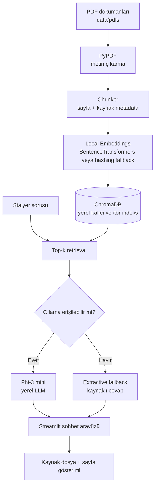

# Microsoft Stajyer Onboarding Asistanı

**Microsoft Stajyer Onboarding Asistanı**, yeni stajyerlerin şirket içi oryantasyon sorularına yerel ve kaynaklı yanıt almasını sağlayan, gizlilik odaklı bir **Retrieval-Augmented Generation (RAG)** demosudur. Uygulama PDF belgelerini yerel olarak okur, parçalara böler, embedding üretir, ChromaDB içinde saklar ve soruya en yakın parçaları getirir. Ollama üzerinde çalışan Phi-3 mini mevcutsa cevap yerel LLM tarafından oluşturulur; Ollama yoksa uygulama çalışmayı bırakmaz ve doküman parçalarından kaynaklı bir extractive yedek cevap üretir.

> **Önemli kapsam notu:** `data/pdfs/` içindeki üç PDF gerçek Microsoft politikası değildir. Sunum, demo ve teknik test amacıyla hazırlanmış kurgusal örnek kurumsal dokümanlardır. Gerçek kurum verileri kullanılmadan önce şirketin güvenlik, hukuk ve bilgi sınıflandırma kuralları doğrulanmalıdır.

## Projenin amacı

Bu proje, bir stajyerin ilk günlerinde karşılaşabileceği “Yemek masrafı limiti nedir?”, “Donanım arızasında kime yazmalıyım?” ve “İlk hafta hangi adımları tamamlamalıyım?” gibi sorulara, ilgili belgenin dosya adı ve sayfa numarasıyla birlikte cevap vermeyi amaçlar. Böylece klasik anahtar kelime aramasına göre daha doğal bir soru-cevap deneyimi ve sunum sırasında doğrudan gösterilebilir bir kurumsal kullanım senaryosu elde edilir.

| Katman | Kullanılan teknoloji | Sorumluluk |
|---|---|---|
| Veri hazırlama | `pypdf` | PDF metnini sayfa bilgisiyle çıkarır. |
| Chunking | Python | Metni örtüşmeli parçalara böler ve kaynak metadata’sı ekler. |
| Embedding | Sentence Transformers | Metinleri yerel anlamsal vektörlere dönüştürür. |
| Yedek embedding | Deterministik hashing | Model indirilemeyen ortamlarda uygulamanın açılmasını sağlar. |
| Vektör veritabanı | ChromaDB | İndeksi disk üzerinde yerel olarak kalıcı biçimde tutar. |
| LLM | Ollama + Phi-3 mini | Sadece yerel Ollama servisine gönderilen bağlamdan yanıt üretir. |
| Arayüz | Streamlit | Sohbet, indeks yenileme, kaynaklar ve sistem durumunu gösterir. |

## Mimari



Ayrıca aynı diyagram `ARCHITECTURE.mmd` dosyasında bulunur. PNG çıktısı üretmek isterseniz proje kökünde şu komutu çalıştırabilirsiniz:

```bash
manus-render-diagram ARCHITECTURE.mmd architecture.png
```

## Hızlı kurulum

### 1. Proje klasörüne geçin ve sanal ortam oluşturun

```bash
cd microsoft-stajyer-onboarding
python3 -m venv .venv
source .venv/bin/activate
python -m pip install --upgrade pip
pip install -r requirements.txt
```

Windows PowerShell kullanıyorsanız aktivasyon komutu şöyledir:

```powershell
.venv\Scripts\Activate.ps1
```

### 2. Ortam ayarlarını kopyalayın

```bash
cp .env.example .env
```

Varsayılan ayarlar, Ollama’nın `localhost:11434` üzerinde çalıştığını ve `phi3:mini` modelinin kullanılacağını varsayar. Ayarların tamamı `.env.example` içinde açıklanmıştır.

### 3. Ollama’yı kurun ve Phi-3 mini modelini çekin

Ollama’yı işletim sisteminize uygun biçimde [resmî indirme sayfasından][1] kurun. Linux ortamında servis çalıştıktan sonra:

```bash
ollama pull phi3:mini
ollama serve
```

`ollama serve` zaten arka planda çalışıyorsa ikinci kez başlatmanız gerekmez. Uygulama Ollama bulunamadığında otomatik olarak yedek cevap moduna geçer.

### 4. PDF indeksini oluşturun

```bash
python cli.py index --clear
```

Bu komut `data/pdfs/` klasöründeki bütün PDF’leri okur, mevcut Chroma koleksiyonunu temizler ve yeni parçaları `chroma_db/` altında saklar. Gerçek veya yeni demo PDF’lerini aynı klasöre koyduktan sonra komutu yeniden çalıştırabilirsiniz.

### 5. Uygulamayı başlatın

```bash
streamlit run app/streamlit_app.py
```

Tarayıcıda Streamlit’in gösterdiği yerel adrese gidin. Sol panelde indeks durumunu görebilir, PDF’leri yeniden indeksleyebilir ve Ollama kullanımını açıp kapatabilirsiniz.

## Komut satırı kullanımı

Streamlit arayüzüne ek olarak CLI ile de çalışabilirsiniz.

| Komut | Açıklama |
|---|---|
| `python cli.py status` | İndeks parça sayısını, embedding backend’ini ve Ollama model ayarını gösterir. |
| `python cli.py index --clear` | Mevcut indeksi temizleyip tüm PDF’leri baştan indeksler. |
| `python cli.py index` | PDF’leri mevcut koleksiyona idempotent biçimde ekler veya günceller. |
| `python cli.py ask "Yemek masraf limiti ne kadar?"` | Ollama erişilebiliyorsa yerel modelle, değilse fallback ile cevap verir. |
| `python cli.py ask "Donanım arızasında ne yapmalıyım?" --no-llm` | LLM çağrısı yapmadan kaynaklı fallback cevabı üretir. |

## Demo senaryosu

Sunumdan önce aşağıdaki hazırlık akışı önerilir:

```bash
source .venv/bin/activate
python cli.py index --clear
python cli.py status
streamlit run app/streamlit_app.py
```

Arayüz açıldığında sırasıyla şu soruları sorabilirsiniz:

| Demo sorusu | Beklenen bilgi |
|---|---|
| “Yemek masraf limiti ne kadar?” | Günlük toplam limitin 250 TL olduğu ve limit üzeri harcamanın ön onaya tabi olduğu bilgisi. |
| “Donanım arızasında kime mail atmalıyım?” | Öncelikle IT Destek Portalı; portal erişilemiyorsa `it-destek@demo-kurum.local`. |
| “Cihazım çalınırsa ne yapmalıyım?” | En geç bir saat içinde mentor ve Güvenlik Operasyonları ekibine bildirim. |
| “İlk gün neleri tamamlamalıyım?” | Mentor görüşmesi, cihaz teslim formu, hesap girişi, güvenlik eğitimleri ve hedef görüşmesi. |
| “Şirketin yıllık izin politikası nedir?” | Demo dokümanlarında bulunmadığı açıkça belirtilir; asistan bilgi uydurmaz. |

## Gizlilik ve güvenlik tasarımı

Uygulamanın temel prensibi, kurumsal PDF içeriklerinin harici bir sohbet servisine gönderilmemesidir. PDF dosyaları, ChromaDB klasörü ve embedding çıkarımı yerel dosya sistemi üzerinde tutulur. LLM seçeneği aktif olduğunda yalnızca retrieved doküman parçaları ve kullanıcı sorusu, `.env` içinde tanımlı yerel Ollama adresine gönderilir. Bu nedenle kurumsal kullanımda Ollama’nın gerçekten aynı makinede veya kurumun izin verdiği izole ağ içinde çalıştığı doğrulanmalıdır.

Aşağıdaki noktalar üretim öncesi ayrıca ele alınmalıdır:

1. Gerçek şirket belgelerine erişim yetkisi ve dosya sınıflandırması kontrol edilmelidir.
2. ChromaDB klasörü işletim sistemi seviyesinde yetkisiz kullanıcı erişimine kapatılmalıdır.
3. Gerçek e-posta adresleri, telefonlar ve kişisel bilgiler demo dokümanlarına yazılmamalıdır.
4. LLM çıktısı kritik İK, hukuk veya güvenlik kararı yerine geçmemelidir; kaynak belge kontrolü zorunlu tutulmalıdır.
5. Gerçek sisteme geçmeden önce audit log, kimlik doğrulama, belge silme politikası ve prompt injection testleri eklenmelidir.

> Asistan, dokümanda bulunmayan bilgiyi tahmin etmemesi için tasarlanmıştır. Bu davranış, kurumsal RAG sistemlerinde “cevap vermek yerine güvenli şekilde bilginin bulunamadığını söyleme” gereksinimini destekler.

## Testler

Bağımlılıklar kurulduktan sonra proje kökünde:

```bash
pytest -q
```

Testler metin parçalamanın örtüşmesini, kaynak metadata’sını, örnek PDF’lerin okunabilirliğini, kaynak gösteren fallback cevabı ve Ollama kapalıyken şeffaf davranışı doğrular.

## Klasör yapısı

```text
microsoft-stajyer-onboarding/
├── app/
│   └── streamlit_app.py
├── core/
│   ├── chunker.py
│   ├── config.py
│   ├── embeddings.py
│   ├── llm.py
│   ├── models.py
│   ├── pdf_loader.py
│   ├── rag_pipeline.py
│   └── vector_store.py
├── data/
│   ├── pdfs/
│   │   ├── 01_masraf_ve_yemek_politikasi.pdf
│   │   ├── 02_donanım_ve_it_destek.pdf
│   │   └── 03_ilk_hafta_ve_iletisim.pdf
│   └── sample_docs/
├── tests/
│   └── test_core.py
├── .env.example
├── ARCHITECTURE.mmd
├── cli.py
├── requirements.txt
└── README.md
```

## Sınırlamalar ve sonraki geliştirmeler

Bu teslim, staj sunumunda çalışır bir MVP ve teknik olarak savunulabilir bir temel sunar. Üretim seviyesine taşınırken belge sürümleme, erişim rolleri, hibrit keyword + vector retrieval, reranking, cevap değerlendirme seti, oturum bazlı audit log ve kurumun onayladığı yerel model eklenebilir. Çok kullanıcılı kullanım için Streamlit’in arkasına kimlik doğrulama ve güvenli servis katmanı eklenmesi gerekir.

## Referanslar

[1]: https://ollama.com/download "Ollama resmî indirme sayfası"

[2]: https://docs.ollama.com/api "Ollama API dokümantasyonu"

[3]: https://docs.trychroma.com/ "ChromaDB dokümantasyonu"

[4]: https://docs.streamlit.io/ "Streamlit dokümantasyonu"

[5]: https://www.sbert.net/ "Sentence Transformers dokümantasyonu"
